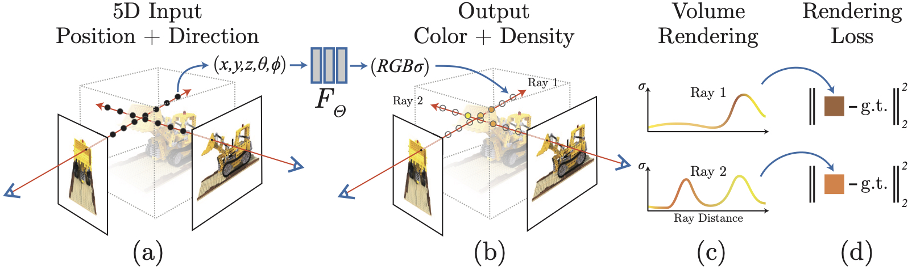

# Wavelet-NeRF


[NeRF](http://www.matthewtancik.com/nerf) (Neural Radiance Fields) is a method that achieves state-of-the-art results for synthesizing novel views of complex scenes. This project is a PyTorch implementation of NeRF, extended with [SIREN-based](https://arxiv.org/abs/2006.09661) and [MFN-based](https://arxiv.org/abs/2011.13961) NeRF variants. The code is based on the authors' original TensorFlow implementation [here](https://github.com/bmild/nerf).


Lego render created by José del Rey using this repository and the NeRF Synthetic
dataset.

## Installation

Use Python 3.10–3.13 and [uv](https://docs.astral.sh/uv/getting-started/installation/).
Run the following commands from the repository root:

```bash
git clone https://github.com/josedelrey/wavelet-nerf.git
cd wavelet-nerf
uv sync --locked
```

`uv sync --locked` installs the versions recorded in `uv.lock` into `.venv/`,
including the development linter. Add `--no-dev` to both `uv sync` and `uv run`
commands to omit development tools. `uv run` uses this environment without
activating it.

Dependencies and project metadata are defined in `pyproject.toml`. The project
is configured with `package = false`: uv manages its dependencies without
building or installing this repository as a distribution.

Training and rendering use CUDA when PyTorch detects a compatible NVIDIA GPU,
and otherwise run on CPU. PyTorch is installed from PyPI using the build for
your platform; on Linux, this may include CUDA runtime dependencies. GPU use
still requires a compatible NVIDIA driver. The former Conda environment is
replaced by the uv setup.

## How To Run?

### Training

Download the original NeRF example archive containing the synthetic `lego`
scene and the LLFF `fern` scene. Requires Bash, `wget`, and `unzip`.

```
bash download_dataset.sh
```

The script places the scenes in `datasets/lego/` and `datasets/fern/`, relative
to the script's location. Existing scene paths are preserved, and rerunning the
script downloads only when a scene is missing. Failed downloads, extraction,
or archive validation stop the script and remove its temporary files.

The Python loader currently supports the Blender-style synthetic format used
by Lego. Fern is downloaded for upcoming LLFF support; it cannot yet be used
with the current training and rendering code.

Train the **baseline NeRF** on `lego`:

```
uv run --locked python train.py --config config/config_nerf_lego.txt
```

Train the **SIREN-NeRF** on `lego`:

```
uv run --locked python train.py --config config/config_siren_lego.txt
```

Train the **MFN (WaveletNet) NeRF** on `lego`:

```
uv run --locked python train.py --config config/config_wavelet_lego.txt
```

Logs are saved in:

```
./logs/<experiment_name>/
```

Model checkpoints are saved in:

```
./models/<experiment_name>/<experiment_name>_<step>.pth
```

Resume training from a checkpoint:

```
uv run --locked python train.py --config config/<your_config>.txt --resume ./models/<exp>/<exp>_050000.pth
```

### More Datasets

To use other scenes from the **NeRF Synthetic dataset**, you can download all datasets from:

[https://www.kaggle.com/datasets/nguyenhung1903/nerf-synthetic-dataset](https://www.kaggle.com/datasets/nguyenhung1903/nerf-synthetic-dataset)

Unzip them and place the scene folders inside the `datasets/` directory of this repository.  
The structure should look like this:

```
datasets/
├── lego/
├── chair/
├── drums/
├── ficus/
├── hotdog/
├── materials/
├── mic/
└── ship/
```

To train on a different dataset, edit the `dataset_path` parameter in the config file.  
For example, to train on **chair**, set:

```
dataset_path = ./datasets/chair
```

Then run:

```
uv run --locked python train.py --config config/config_nerf_lego.txt
```

This example uses the existing baseline config after changing its dataset path.
Also choose a new `experiment_name` so its outputs are separate from Lego runs.

### Render a video

Once you have trained a model, render frames with:
```
uv run --locked python eval.py \
  --config config/config_nerf_lego.txt \
  --checkpoint ./models/nerf/nerf_250000.pth \
  --output ./renders/nerf_lego_eval
```

Then you can make a video with this ffmpeg command:
```
ffmpeg -y -framerate 30 -i ./renders/nerf_lego_eval/frame_%04d.png \
  -c:v libx264 -pix_fmt yuv420p -crf 18 ./renders/nerf_lego_eval.mp4
```

FFmpeg is an external command required only for this video conversion step.
Inspect training logs with:

```bash
uv run --locked tensorboard --logdir logs
```

## Development

Run the dependency, lint, and command-line checks used in CI:

```bash
uv sync --locked
uv run --locked ruff check .
uv run --locked python train.py --help
uv run --locked python eval.py --help
uv run --locked python -m unittest discover -s tests
```

Use `uv add <dependency>` or `uv add --dev <tool>` when changing dependencies,
and commit both `pyproject.toml` and `uv.lock`. To update an existing dependency
deliberately, run `uv lock --upgrade-package <dependency>`, then
`uv sync --locked` and the checks above. No distribution build is required.

## Method

[NeRF: Representing Scenes as Neural Radiance Fields for View Synthesis](http://tancik.com/nerf)  
 [Ben Mildenhall](https://people.eecs.berkeley.edu/~bmild/)\*<sup>1</sup>,
 [Pratul P. Srinivasan](https://people.eecs.berkeley.edu/~pratul/)\*<sup>1</sup>,
 [Matthew Tancik](http://tancik.com/)\*<sup>1</sup>,
 [Jonathan T. Barron](http://jonbarron.info/)<sup>2</sup>,
 [Ravi Ramamoorthi](http://cseweb.ucsd.edu/~ravir/)<sup>3</sup>,
 [Ren Ng](https://www2.eecs.berkeley.edu/Faculty/Homepages/yirenng.html)<sup>1</sup> <br>
 <sup>1</sup>UC Berkeley, <sup>2</sup>Google Research, <sup>3</sup>UC San Diego  
  \*denotes equal contribution  
  


Pipeline figure from Mildenhall et al., *NeRF: Representing Scenes as Neural
Radiance Fields for View Synthesis* (ECCV 2020), obtained from the
[original NeRF repository](https://github.com/bmild/nerf/blob/master/imgs/pipeline.jpg).

> A neural radiance field is a simple fully connected network (weights are ~5MB) trained to reproduce input views of a single scene using a rendering loss. The network directly maps from spatial location and viewing direction (5D input) to color and opacity (4D output), acting as the "volume" so we can use volume rendering to differentiably render new views


## Citation

We acknowledge the original authors of NeRF for their groundbreaking work:
```
@misc{mildenhall2020nerf,
    title={NeRF: Representing Scenes as Neural Radiance Fields for View Synthesis},
    author={Ben Mildenhall and Pratul P. Srinivasan and Matthew Tancik and Jonathan T. Barron and Ravi Ramamoorthi and Ren Ng},
    year={2020},
    eprint={2003.08934},
    archivePrefix={arXiv},
    primaryClass={cs.CV}
}
```

## License and attribution

Project-authored code and documentation, and the combined software including
the MFN adaptation, are licensed under [AGPL-3.0-only](LICENSE). Upstream MIT
notices for NeRF and SIREN are preserved in the same file.

The MFN base and Gabor-style filter construction in `modules/models.py` are
adapted from [Fathony et al.'s implementation](https://github.com/boschresearch/multiplicative-filter-networks).
Frequency controls, optional LayerNorm, and the NeRF integration are local
extensions. The SIREN layers draw on
[Sitzmann et al.'s implementation](https://github.com/vsitzmann/siren).

The pipeline figure belongs to the original NeRF authors and is not relicensed
by this project. The Lego GIF was generated with this repository; its
project-authored contributions are offered under AGPL-3.0-only, without changing
rights in the underlying scene assets.

The downloader uses the example archive distributed by the
[original NeRF project](https://github.com/bmild/nerf), which contains Lego and
Fern. The script retains both scenes. Downloaded datasets remain subject
to their original rights-holder terms; this repository's software license
grants no additional dataset rights. See [LICENSE](LICENSE) for source links,
attribution, and the complete notices.
