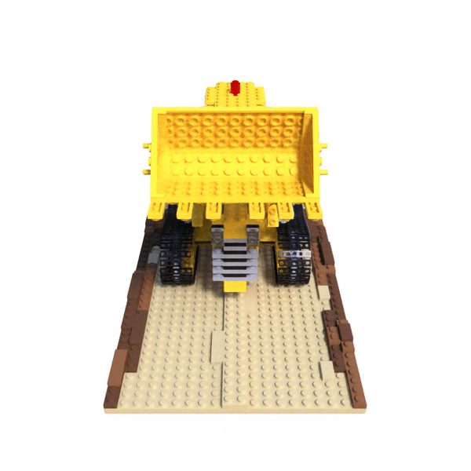
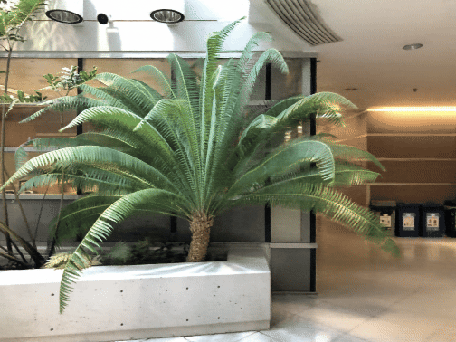

# Wavelet NeRF

[](https://github.com/josedelrey/wavelet-nerf/actions/workflows/ci.yml)
[](https://www.python.org/)
[](https://pytorch.org/)
[](LICENSE)

PyTorch experiments for novel-view synthesis with NeRF, SIREN, and wavelet
multiplicative filter networks. Includes the synthetic Lego and LLFF Fern scenes.


> A neural radiance field represents a scene as a network trained to reproduce
> its input views. It maps a 3D position and viewing direction to color and
> density. Volume rendering combines these predictions along camera rays to
> form an image, allowing the network to learn from photographs and render
> new views of the same scene.

## Model variants

The idea is to keep NeRF's rendering process and explore different ways to
represent the scene. All three models predict density and color at points along
camera rays, then use volume rendering to reconstruct the training images.

- **NeRF** uses a ReLU network with positional encoding of 3D coordinates.
- **SIREN** feeds coordinates directly into layers with sine activations,
  replacing the positional encoding and ReLU layers in the spatial network.
- **WaveletNeRF** uses a multiplicative filter network (MFN). Its filters combine
  sine waves with learned Gaussian envelopes, then multiply their outputs with
  transformed features at each layer to build a spatial representation.

In every model, density depends only on position. The color branch also receives
encoded viewing directions so appearance can change with the camera angle.

## Installation

Supported on Linux with Python 3.10–3.13. Requires Git and [uv](https://docs.astral.sh/uv/getting-started/installation/).
Run commands from the repository root.

```bash
git clone https://github.com/josedelrey/wavelet-nerf.git
cd wavelet-nerf
uv sync --locked
source ./.venv/bin/activate
```

The default installs CPU PyTorch. For an NVIDIA GPU with a CUDA 13.0 compatible
driver, replace the environment's CPU build with:

```bash
uv sync --locked --no-group cpu --group cu130
```

Training and evaluation use CUDA when available. Install FFmpeg with `libx264`
for video output.

## Datasets

Download Lego and Fern from the [original NeRF project](https://github.com/bmild/nerf).
Requires Bash, `wget`, and `unzip`.

```bash
bash download_dataset.sh
```

The scenes are saved to `datasets/lego/` and `datasets/fern/`. Existing scenes
are preserved. Datasets and generated outputs are ignored by Git.

## Training

Train NeRF on Lego:

```bash
python train.py --config configs/config_nerf_lego.yaml
```



Train NeRF on Fern:

```bash
python train.py --config configs/config_nerf_fern.yaml
```



Lego uses full resolution and 500,000 updates. Fern uses factor-8 downsampling
and 200,000 updates. SIREN and wavelet variants are available in [configs/](configs/).
For a short CPU check, use the two-update configs in [configs/smoke/](configs/smoke/).

Checkpoints are saved under `models/<experiment_name>/` and training logs under
`logs/<experiment_name>/`. Resume from a saved checkpoint with:

```bash
python train.py --config configs/config_nerf_fern.yaml \
  --resume models/nerf_fern/nerf_fern_050000.pth
```

View training progress with:

```bash
tensorboard --logdir logs
```

## Evaluation

Render a video using the latest checkpoint for the same config:

```bash
python eval.py --config configs/config_nerf_lego.yaml
python eval.py --config configs/config_nerf_fern.yaml
```

Lego renders an orbit and Fern renders a spiral. Outputs follow this layout:

```text
logs/<experiment_name>/
├── renderonly_path_<step>/
│   ├── 000.png
│   └── ...
└── <experiment_name>_spiral_<step>_rgb.mp4
```

Use `--no-video` for PNG frames only, `--checkpoint` to select a saved model,
or `--output` to choose a directory. An explicit output directory contains
`frame_0000.png`, etc., and `video.mp4`. Add `--overwrite` to replace an earlier render.

Evaluate held-out views and save predicted images, MSE, and PSNR metrics:

```bash
python eval.py --config configs/config_nerf_lego.yaml --mode test
python eval.py --config configs/config_nerf_fern.yaml --mode test
```

Test outputs are saved to `logs/<experiment_name>/testset_<step>/`, including
`metrics.json` and `metrics.csv`.

## Citations

- [NeRF](https://arxiv.org/abs/2003.08934), Mildenhall et al., ECCV 2020.
- [SIREN](https://arxiv.org/abs/2006.09661), Sitzmann et al., NeurIPS 2020.
- [Multiplicative Filter Networks](https://arxiv.org/abs/2011.13961), Fathony et al., ICLR 2021.

## License

Project-authored code and documentation are licensed under
[AGPL-3.0-only](LICENSE). The MFN and SIREN layers draw on the
[MFN implementation](https://github.com/boschresearch/multiplicative-filter-networks)
and [SIREN implementation](https://github.com/vsitzmann/siren). Upstream notices
and attribution are included in `LICENSE`.

The pipeline figure comes from the MIT-licensed original NeRF repository.
Project-authored contributions to the Lego and Fern GIFs are licensed under
MIT. The underlying scene assets retain their original rights. See
[LICENSE](LICENSE) for details.
